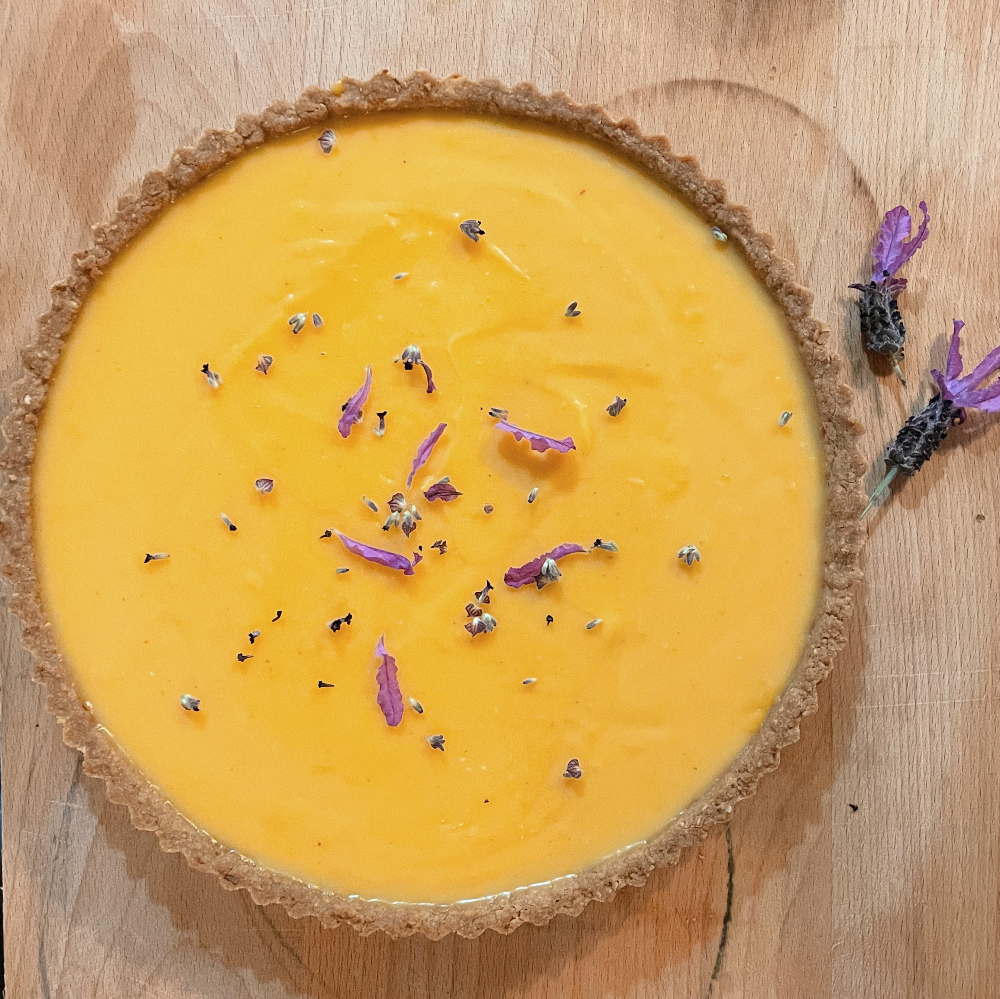

export const metadata = {
	title: 'Test: Lemon & Lavender Curd Tart',
	description: 'A zesty lemon curd tart infused with fragrant lavender, set in a buttery coconut crust.',
}

# Lemon & Lavender Curd Tart

## Ingredients

### Curd

- 1⅓ cups lemon juice (320 ml), about 8–10 lemons
- 6 eggs
- 6 egg yolks
- 300 g unsalted butter, cut into large cubes
- 1⅓ cups caster sugar (265 g)
- 10–15 lavender flowers

### Base

- 150 g plain flour
- 110 g brown sugar
- 50 g desiccated coconut
- 125 g unsalted butter, melted
- Pinch of salt

## Method

### Curd

1.  I like to make the curd the day before making the base, which makes the whole thing just a lot easier, but it’s not essential.

2.  In a bowl, add sugar and half of your lavender. Using your fingers, rub the lavender into the sugar, releasing the oils and fragrance. You may notice the sugar goes slightly purple. You want to break down the lavender as much as possible here. Take your time with it, it’s quite satisfying and you’ll enjoy a bit of aromatherapy while you’re there.

3.  In a medium-sized saucepan (big enough to comfortably fit a litre of curd), combine eggs, yolks, lemon juice, sugar and lavender. Whisk over a low heat until combined and the sugar completely dissolves.

4.  Add the butter one cube at a time, stirring constantly with a wooden spoon and waiting for each cube to melt fully. Continue stirring after all the butter is added until the curd thickens well and coats the back of the spoon.

5.  Strain the curd through a sieve to remove any blobs of egg and lavender buds. Set aside to cool. It will continue thickening as it cools. If making ahead, place in an airtight container or jar in the fridge.

### Base

6.  For the base, heat the oven to 180°C.

7.  Combine all dry ingredients in a medium sized mixing bowl. Melt butter and combine with dry ingredients.

8.  Into a tart tin with a loose base (approximately 24 cm diameter), use your fingers or the bottom of a cup to press the mixture into the base and up the sides as evenly as possible.

9.  Bake for 15–18 minutes until golden. Be careful here because it can go from golden to burnt quickly.

10. Remove from the oven and leave to cool in the tin. Once cool, refrigerate the base for 30–60 minutes to make it a little less fragile for removing from the tin.

11. Once cooled, remove from the tin and fill with cooled curd. Pull apart the buds from your remaining lavender and sprinkle over the top. A little lemon zest is nice here too.

12. Refrigerate the assembled tart for a few hours before serving so the curd sets and settles into the shell.
