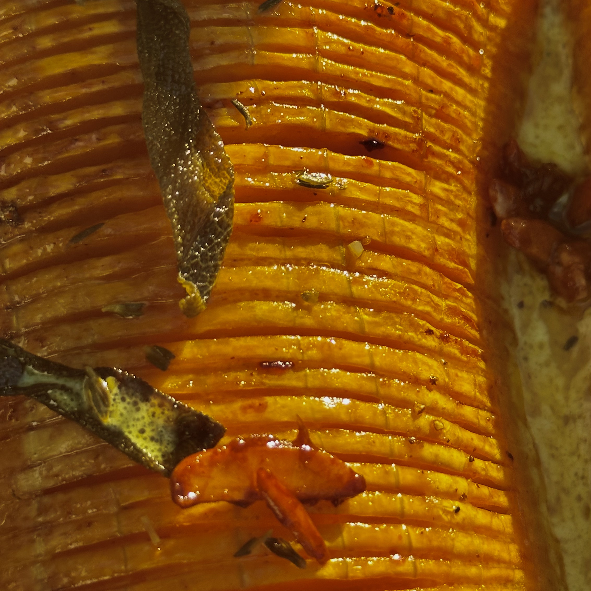

Roasted squash with a maple glaze, a buttery cream sauce and a shower of almond praline and crispy sage. Hasselbacking the squash creates little crevices for the glaze to caramelise. The sauce is a classic beurre blanc with a hint of curry powder for warmth; the praline adds crunch against the soft squash.

## Ingredients

- 1 whole butternut squash
- 1 Tbsp olive oil (15 ml)
- 3 Tbsp unsalted butter (45 g)
- 2 sprigs sage
- 1/4 cup maple syrup (60 ml)
- 2 Tbsp apple cider vinegar (30 ml)
- Pinch of chilli powder
- 1/2 cup chopped almonds (70 g)
- 80 g unsalted butter
- 1/2 shallot, finely chopped
- 1 tsp yellow mustard powder
- Fine salt and black pepper
- 1 tsp curry powder
- Small handful parsley, chopped
- Few thyme sprigs
- 2 tsp lemon juice (10 ml)
- 100 ml cream

## Method

### Squash

1. Preheat oven to 200ºC.
2. Peel and split the squash lengthways, remove the seeds and clean the cavity. Rub with the olive oil, season with salt and pepper and bake for 15 minutes.
3. Meanwhile, melt 3 Tbsp (45 g) butter in a pan, then add the sage sprigs. When it sizzles, add the maple syrup, apple cider vinegar and a pinch of chilli powder. Cook until thick enough to coat the back of a spoon, then remove from the heat. Lift out the sage sprigs and reserve for garnish. Reserve a little of the glaze for the praline.
4. Take the squash out and let it cool. Place two chopsticks along the length of the squash on either side and use a very sharp knife to make the little cuts breadthwise. The chopsticks prevent the knife from cutting all the way and keep the bottom part of the squash intact for support.
5. Brush the hasselbacked squash with the maple glaze, and pour the rest of the glaze freely. Return to the oven for about 30 minutes at 210ºC. Every 10 minutes, baste with more glaze from the pan.

### Praline

6. While the squash cooks, bring the reserved glaze back to the boil and add the chopped almonds. Cook until the glaze thickens and coats the nuts. Spread on a baking sheet and bake at 180ºC for 10 minutes. Cool completely, then break into pieces.

### Sauce

7. In a non-stick pan, add 80 g butter, the chopped shallot, mustard powder, black pepper, a pinch of salt and the curry powder. Sauté until the butter foams, then clarify by straining to remove the solids. Add the chopped parsley and thyme sprigs, then stir in the lemon juice and cream.

### To serve

8. Place the squash on a flat plate and pour the sauce around it. Garnish with the praline and crispy sage leaves.
