import { TabsExample } from './tabs'

<Suspense>
  <ResponsivePreview width={400}>
    <TabsExample tabs={[
    { label: 'Camden', value: '1' },
    { label: 'Bond St', value: '2' },
    { label: 'Bethnal Green', value: '3' },
    { label: 'Brixton', value: '4' },
    { label: 'Finsbury Park', value: '5' },
    { label: 'Greenwich', value: '6' },
    { label: 'Tottenham', value: '7' },
    { label: 'Tower Hill', value: '8' },
    { label: 'Wembley', value: '9' },
  ]} />
  </ResponsivePreview>
</Suspense>

Houston is the name of the design system at Vend — "Houston, we have a problem". The team has pragmatically and organically worked on Houston for a few years, and it's organically grown and changed over time.

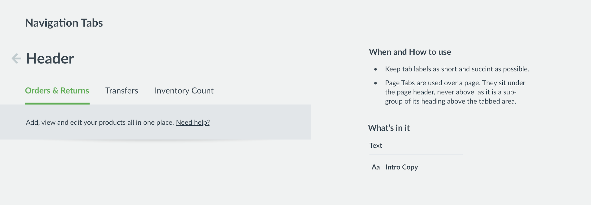

This is a snippet of Houston's design documentation for a tabs component.

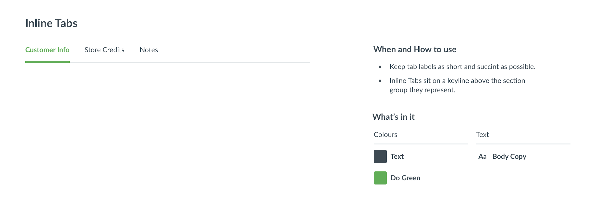

In-context designs are also curated with the docs. These help future designers understand how to use a component, but also aid during design to “road-test” the component.

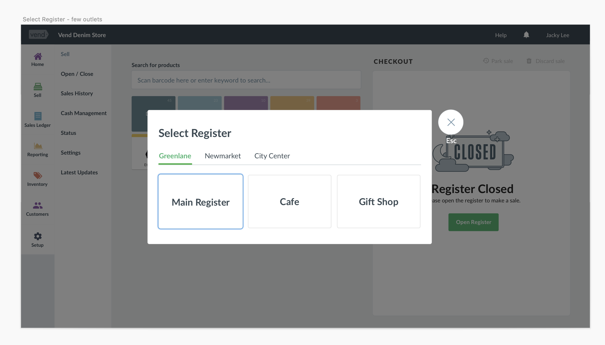

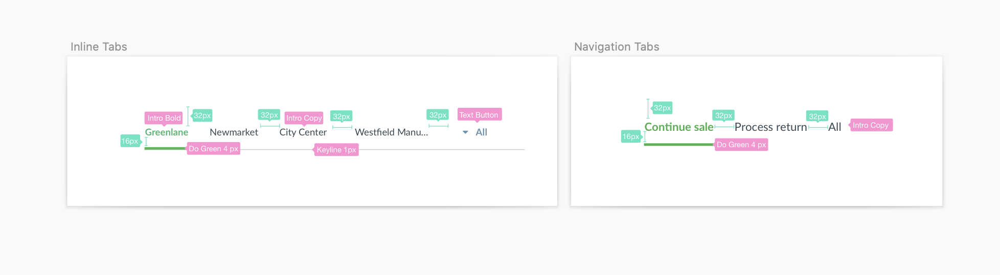

## The problem

When tabs were initially designed and developed, the team hadn't anticipated them being used with so much content. The component visually breaks when the tabs wrap and the pattern no longer makes sense. 

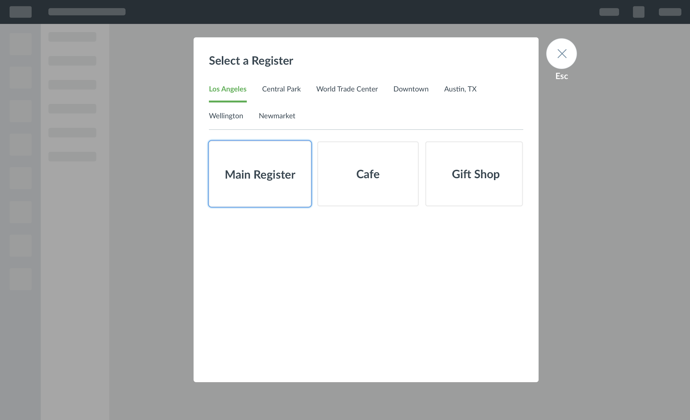

New uses push designs forward. The reason I chose to walk you through a case study of a component that already exists is that this feels like a much more common scenario, especially within a mature design system. A lot of the time we're not working from scratch—we're building on top of what's there, with existing constraints, leveraging existing patterns, and questioning design decisions.

## Establishing a case for a new/changed component

- Are we just using tabs "wrong"?
- Are there other patterns for dealing with this kind of content?
- Do we need to look at the problem in the context of the business and product?

### Business focus

Why is supporting something like this important? One of the reasons I can assume that we didn't anticipate this overflow problem is that when we looked at the original use cases, the core customer for Vend was smaller. Because of the small size of the team, we take quite a pragmatic approach to defining scope. We don't worry about things that don't bring value to our customers. Don't create deviations of components unless you actually have to. 

Very frequently we thought we might need variations of a component, but by continually denying ourselves the option, we realized that we either didn't need them at all or could find a different solution to the problem for which we were about to create a variation. Vend has started to look more closely at its unit economics and what sort of customer "fits" and is profitable for us. As we focus on larger customers, the product has to grow to cater more towards them. Larger customers mean more locations, more complex needs—in general, more of everything.

Working on another project, we ran into this issue again. We'd started exploring how third-party add-ons would be surfaced within the product. How do we attach and attribute extra metadata to entities in Vend? We were pretty sold on this approach. This raises the issue that we no longer have control over the content.

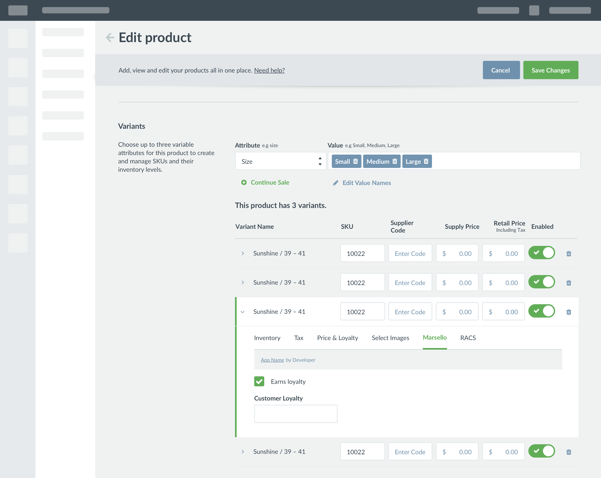

One of the reasons we take such a pragmatic approach is because we see the design system as a contract between dev and design. We agree to design within these boundaries, and engineering is able to reduce complexity and effort. This comes about because of our team structure. It's ad-hoc in nature, dealing with issues as they arise and impact work. The concept of YAGNI (You Aren't Gonna Need It) is pretty pragmatic in the way we deal with value and effort. In the past, we've been bitten by projects that have ballooned and been delayed by over-engineering and underestimation. Sometimes good is good enough. How do we slice work small so that we can deliver value at every step of the way, understanding the risks and measuring the return on investment?

## Interrogating the original purpose

Tabs are used in a group as page or section controls, each representing a page or section of a page that is a sibling of each other. Only one tab is active at a time, displaying its content while hiding that of other tabs.

Words before pixels—it's so much easier to speak the same language. Of all the other benefits, design systems increase the efficiency of different teams working together simply because they unify the language that the two teams are using. I have a real interest in semantics. What we call something has so much impact on how we can use it. Having clear names establishes a shared understanding.

Tabs can function as a tertiary form of navigation. We can start to also critique the current rationale: should tabs include user-generated content? We start questioning whether this is the right pattern for content we don't control.

If we take that same visual language and apply it to the tabs, our users know to scroll. One thing we're very averse to doing at Vend is truncating content. We think that we should respect our users' content—this goes into a larger topic of dealing with edge cases. A lot of our product is desktop-based, focused on a retailer's jobs-to-be-done. At times we've chosen not to invest in supporting mobile. A lot of our components and designs going forward do work at these breakpoints, but following that rule of YAGNI, we think sometimes there is more valuable work we could be doing. At a systems level, I still think it's really valuable that we invest the time—enabling us to scale in the future. Here, it also greatly exaggerates the issue at hand.

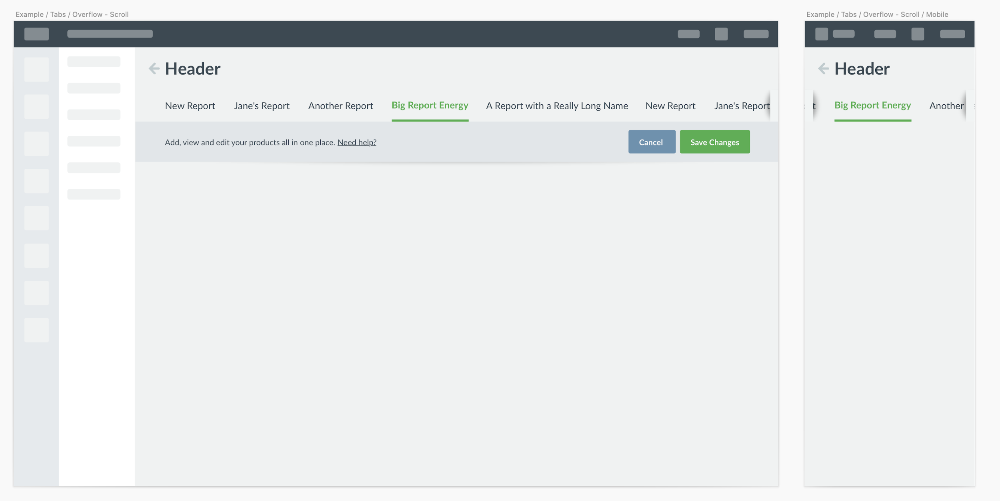

Another approach we took was to create some sort of overflow menu. This spurred a lot of questions:
- What lives in the popover, and what lives in the tabs?
- Is it static or dynamic?
- How complex is this to build? We'd need to watch the viewport size.
- This still seems to break on mobile.

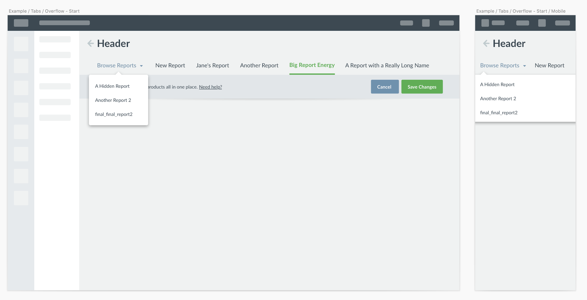

We then started to question if a tab could start to function by itself. In our visual system, an active tab isn't interactive. We use our green across the product to indicate state. Could tabs become just an indicator for the current page, leaving all navigation to the overflow?

- If we look back to the original intention of tabs, this seems like a step too far.
- Just because we can, doesn't mean we should.
- From a development perspective, this also seems like it could be complex.
- Would we never show all the tabs? Do it dynamically depending on the viewport?

The mobile breakpoint really highlights this—we still run into overflow issues with a long name. This is also where the gold started to appear. If we combine this dropdown with the overflow shadow, could a user scroll through all tabs, not just the active one?

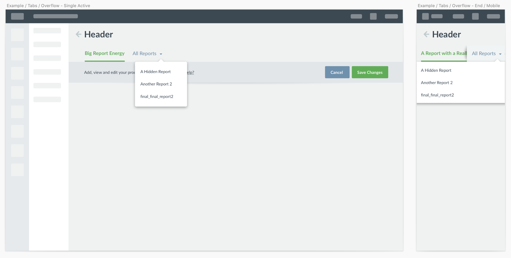

We started to combine some of these concepts into something that appears to deal with the problem at hand while also respecting the current implementation. We'd recognized earlier that scrolling horizontally on a small touch area might be an issue. So we started to revisit that core definition of what tabs are: both a navigation element and an indicator for current location. We can then question if we can split those functions. The tabs maintain the visual indicator for place, but the button becomes the function for navigation. With this focus, we can look closer at the overflow button.

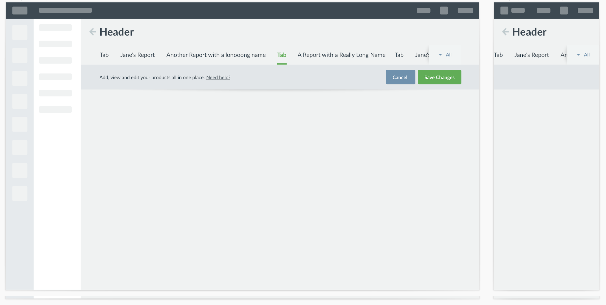

The popover naturally becomes a translation of the tab bar, but vertically. So many of the questions we had earlier about when and which content to show become answered with this approach. With those functions defined earlier, we can start talking to them. If I navigate to an item hidden in the tab bar from the overflow, what should happen?

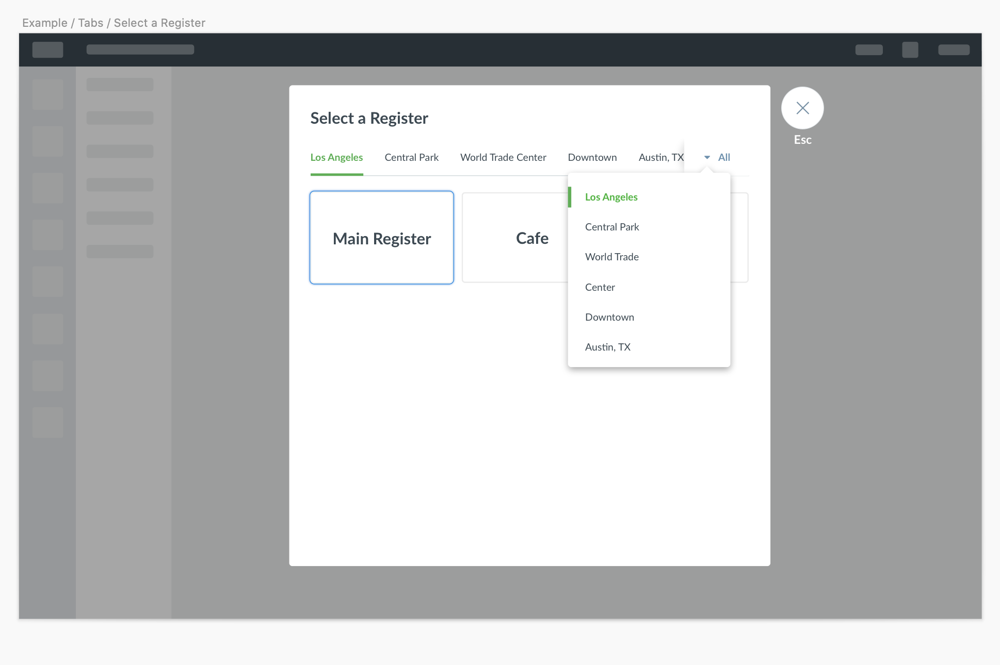

This is where we can start to see how this new overflow component can scale with existing components. We already have patterns for dealing with finding something in a list. Say you have 30 outlets across the states—we can leverage existing search and filter patterns.

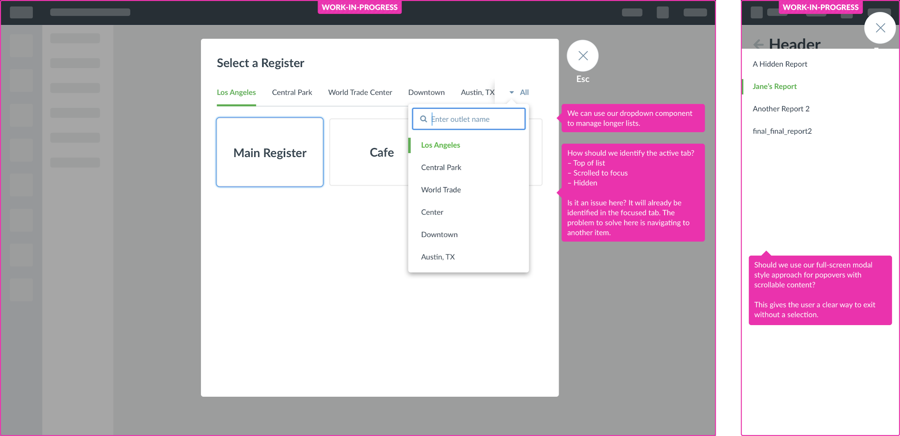

During this time, we're road-testing the components in-situ across the product. We realized that when the tabs serve a navigation role as opposed to filters, "All" might not be the best name for the collection of tabs—we need to consider what a user is actually looking for.

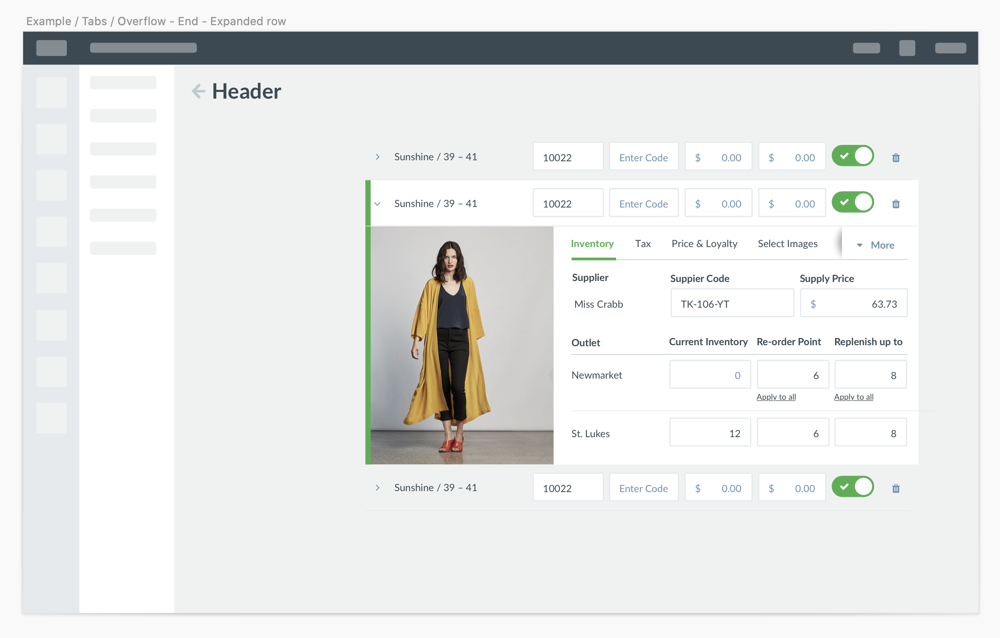

## Documenting the changes

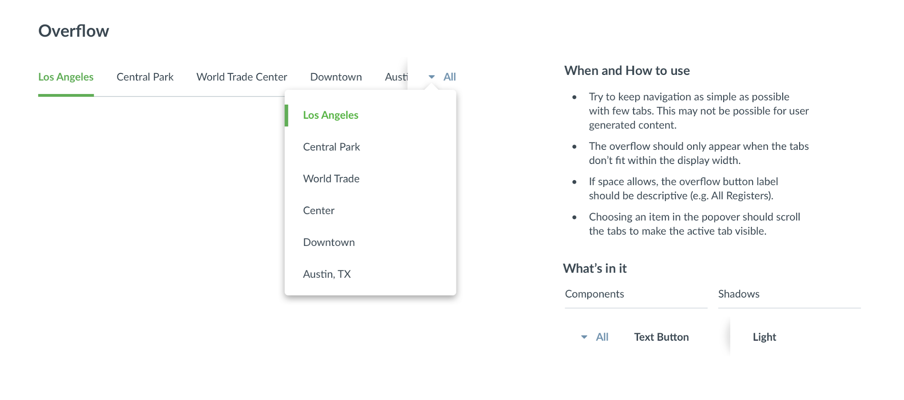

## Playground 

Try it out yourself! Resize the panel to see how the overflow behaves.

<Suspense>
  <ResponsivePreview width={600}>
    <TabsExample tabs={[
    { label: 'Inventory', value: 'inventory' },
    { label: 'Tax', value: 'tax' },
    { label: 'Price & Loyalty', value: 'price-loyalty' },
    { label: 'Select Images', value: 'select-images' },
    { label: 'RACS', value: 'racs' },
  ]} />
  </ResponsivePreview>
</Suspense>
