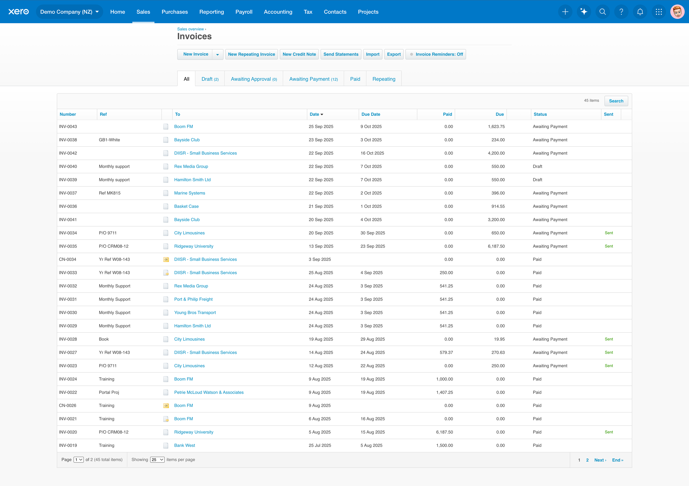
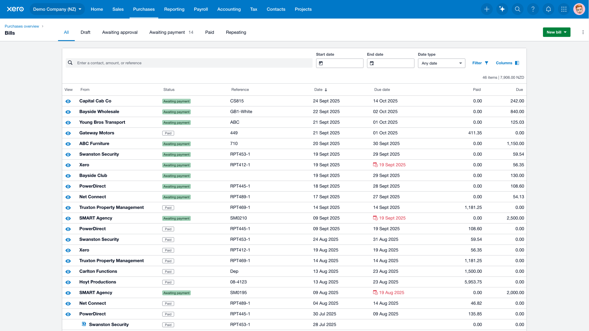
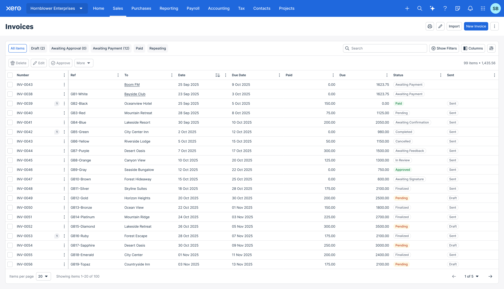
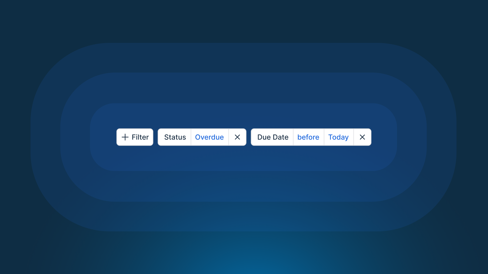
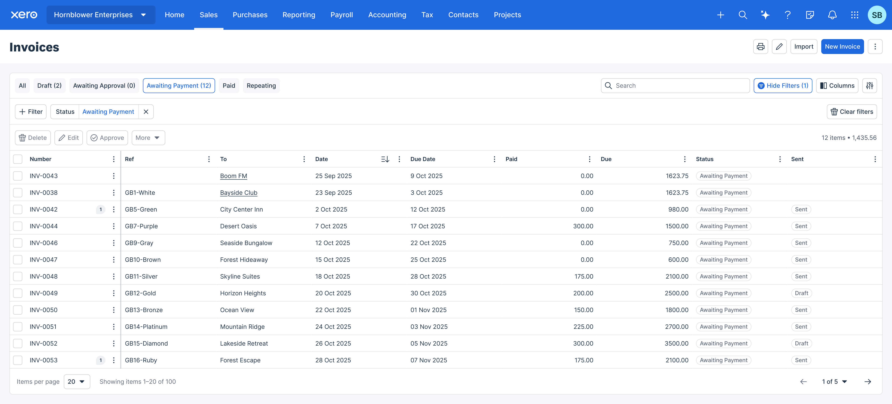
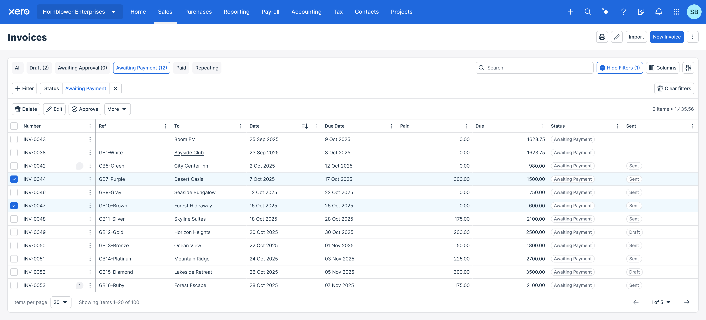
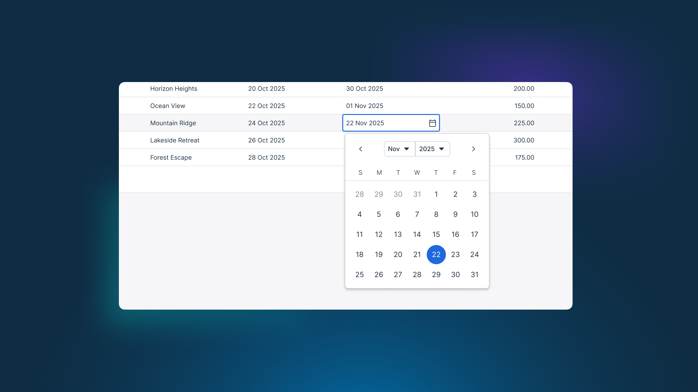

Tables are a fundamental component in many software applications, especially in data-intensive platforms like Xero. They provide a structured way to present large amounts of information, allowing users to easily scan, compare, and interact with datasets within Xero.

<Grid columns={3} maxWidth="800px" >

</Grid>

## Legacy

Tables in Xero have historically been built using a variety of different approaches, resulting in inconsistent experiences across the product. Differences in filtering, sorting, and interaction patterns have lead to confusion and frustration for users.

As new features were added, tables became increasingly complex and difficult to use. This highlighted the need for a unified approach to table design and functionality.

## Principles

1. **Reliably familiar**\
Tables maintain consistent patterns, interactions, and visual language across all experiences.
Users seamlessly apply knowledge between different tables without needing to relearn the pattern – creating an intuitive and unified product experience.
2. **Personalised over opinionated**\
Empower customers to personalise tables for their specific needs. Starting with good defaults, we enable users to create their own views, saving time and increasing efficiency by focusing on what's most relevant to them.

## Redesign

The redesigned tables focus on improving usability, accessibility, and visual clarity. Key features include:
- Enhanced readability with improved typography and spacing
- Advanced filtering and sorting options
- Bulk actions for efficient data management
- Inline editing capabilities for quick updates
- Maintaining the same density to display more data on screen

### Views

<Video video="xui-table-views.mp4" autoplay muted loop />

Views allow users to quickly switch between different table configurations. Xero can provide sensible defaults for common jobs-to-be-done, while empowering users to create and save their own views for their specific needs and use-cases.

### Filtering and sorting

A large focus of the redesign was to empower customers to quickly find and act on the data they need. 

We rethought how tabular data is displayed and adopted a simple rule: each column should show one clear, distinct data point. That clarity makes filtering and sorting more accurate and meaningful for users.

### Bulk actions

Bulk actions enable users to efficiently manage multiple records at once, saving time and reducing repetitive tasks.

### Editing

Inline editing allows users to quickly update data without needing to navigate away from their context in the table.

## Impact

The redesigned tables have received positive feedback from users, who appreciate the improved usability and efficiency. Early metrics indicate increased engagement with table features, such as filtering and bulk actions, leading to higher productivity for Xero customers.

