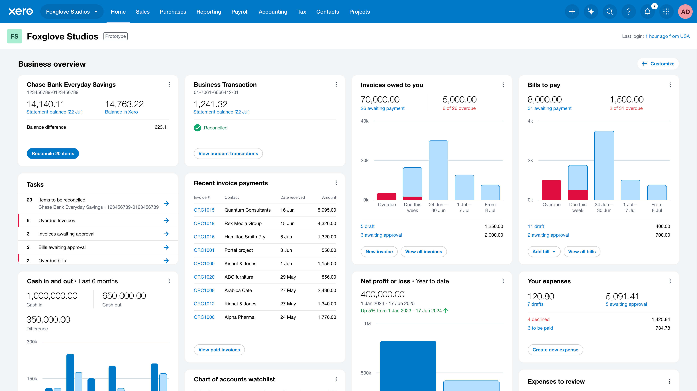
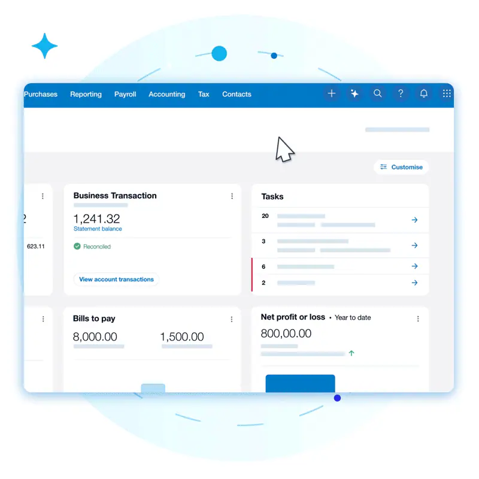

Helping customers get a clearer view of business performance quickly with new widgets that highlight what needs their attention. Tailored to each customer, it helps them stay focused on what matters most and guides them what to do next.

Redesigned from the ground up, it’s a more intuitive, actionable space, purpose-built to help customers move faster and make smarter decisions with confidence.

<Video video="announcement.mp4" />

<Video video="comparison.mp4"  />

The new task list helps customers prioritise and take prompt action on outstanding invoices and bills, and the enhanced banking widget shows where they have a balance difference and should complete a bank reconciliation.

## Research and insights

Qualitative research with over 3,000 people including small business owners, accountants, and bookkeepers helped identify key pain points with the existing homepage and navigation. Customers found it difficult to quickly find the information they needed, and often felt overwhelmed by the amount of data presented.

### 6 key questions that customers wanted answers to

- How much money do I owe?
- How much money is owed to me?
- How many of the most recent invoices have been paid?
- Are we making a profit?
- How much money is in the bank?
- Can we afford to pay our bills?

New widgets for daily tasks including recently paid invoices, and profit and loss. As well as enhancements to some of customers' favourite widgets, like bank reconciliation, bills to pay, invoices owed to you and chart of accounts watchlist.

Customers can personalise the homepage for a view that works for them. Show, hide, and move things around as they like, so they see what matters most to them.

30,000 customers have already opted in to try the new experience during the beta phase, providing valuable feedback to help us refine and enhance the design before its full release.
