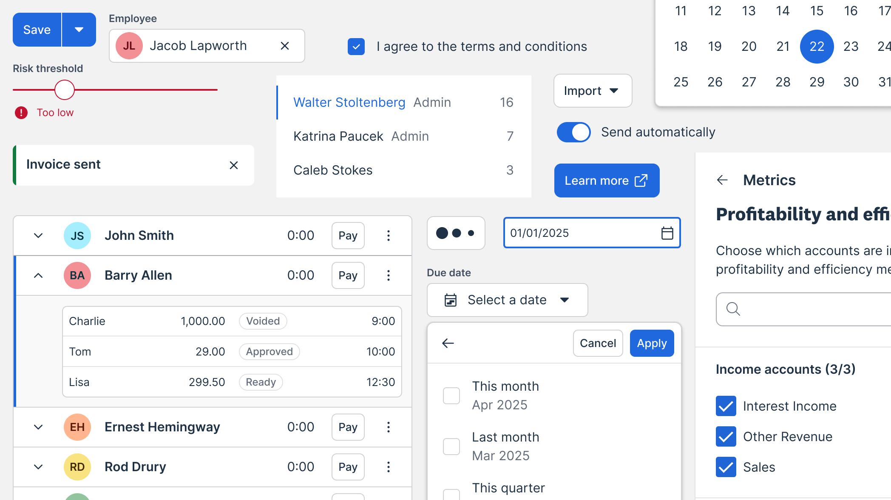
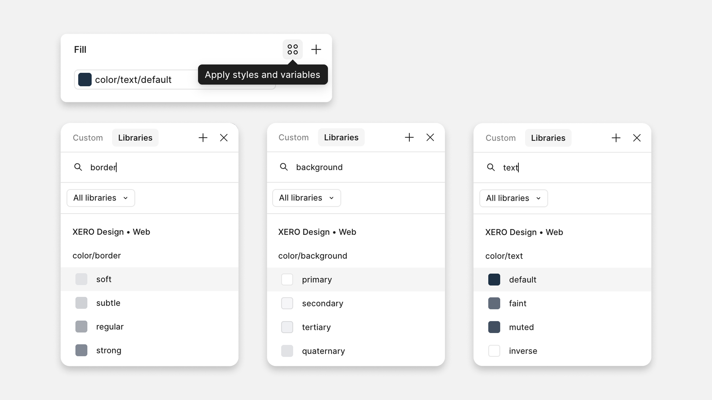
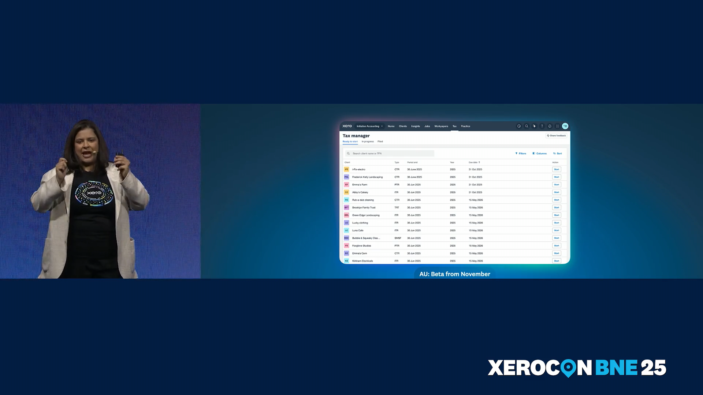

<Text serif size="lg">XUI (Xero User Interface) is Xero's design system, created to ensure a consistent and cohesive user experience across all Xero products. It provides a comprehensive set of design principles, guidelines, reusable components and patterns that empower designers and developers to focus on solving customer problems while maintaining brand integrity.</Text>

XUI is not just a component library; it's a living system that evolves with Xero's needs. It fosters collaboration between cross-functional teams, enabling them to build high-quality products faster and more efficiently.

- 60+ components
- Built with React, TypeScript and SASS
- Figma library
- WCAG 2.2 AA accessible
- Responsive
- Design tokens for colors, typography, spacing, and more
- Documentation for designers and developers
- Community contribution model

## Adoption & impact

XUI is widely adopted across Xero's product suite, with every new feature and product utilizing the design system. XUI is used by over 100 product teams with 120+ designers and 1,000+ developers. This adoption has led to significant improvements in development speed, consistency, and user satisfaction. Teams have reported an 80% reduction in time to ship new features, allowing them to focus more on innovation and customer needs.

## Figma Plugin

<Video autoplay loop muted video="xui-figma-plugin.mp4" />

Onboarding to a new design system can be a daunting task, unfamiliar names and different component patterns can be difficult to pick up. We wanted the experience to be as seamless as possible, promoting discovery of components and best practices.
We integrated XUI's Figma library directly into the plugin so that when someone selects a XUI component, they can see the documentation for that component without searching.

