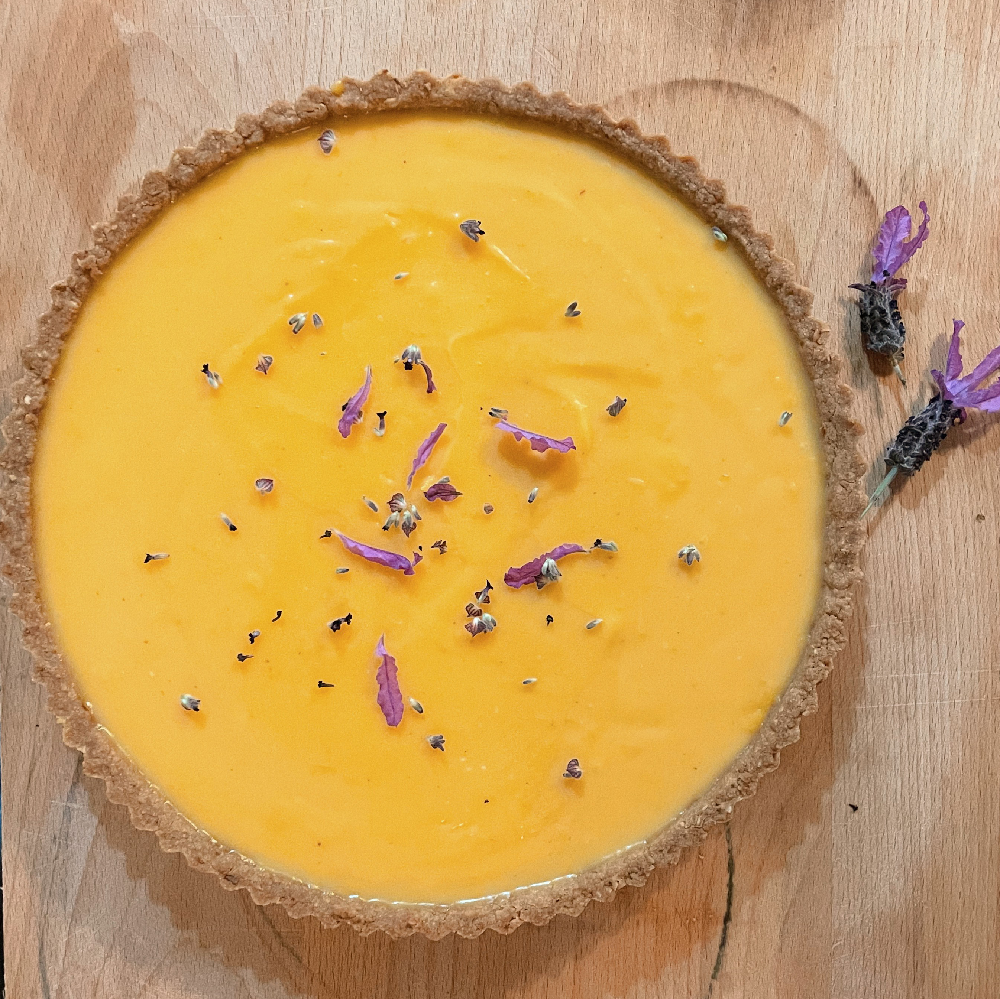

## Ingredients

- 1 ⅓ cups lemon juice, about 8—10 lemons
- 6 eggs
- 6 egg yolks
- 300g butter, cut into large cubes
- 1 ⅓ cups of sugar
- 10–15 lavender flowers
- 150g plain flour
- 110g brown sugar
- 50g desiccated coconut
- 125g unsalted butter (melted)
- pinch of salt

## Steps

### Curd

1.  I like to make the curd the day before making the base, which makes the whole thing just a lot easier, but it’s not essential.

2.  In a bowl, add sugar and half of your lavender. Using your fingers, rub the lavender into the sugar, releasing the oils and fragrance. You may notice the sugar goes slightly purple. You want to break down the lavender as much as possible here. Take your time with it, it’s quite satisfying and you’ll enjoy a bit of aromatherapy while you’re there.

3.  In a medium sized saucepan (big enough to comfortably fit a litre of curd), combine eggs, yolks, lemon juice, sugar and lavender, whisking over a low heat until combined and sugar completely dissolves.

4.  Add in butter, one cube at a time and using a wooden spoon, stir constantly between each addition, waiting for each cube to melt fully. Continue stirring after all butter is added, until it’s thickened well. The curd should coat the back of the wooden spoon.

5.  Strain the curd through a sieve to remove any blobs of egg and lavender buds. Set aside to cool. It will continue thickening as it cools. If making ahead, place in an airtight container or jar in the fridge.

### Base

6.  For the base, preheat oven to 180 C.

7.  Combine all dry ingredients in a medium sized mixing bowl. Melt butter and combine with dry ingredients.

8.  Into a tart tin with a loose base (approximately 24cm diameter), use your fingers or the bottom of a cup to press the mixture into the base and up the sides as evenly as possible.

9.  Bake in the oven for 15-18 minutes until golden. Be careful here because it can go from golden to burnt pretty quickly.

10. Remove from oven and leave to cool in tin. Once cool enough, I like to refrigerate the base for 30-60 minutes to help make it a little less fragile for removing it from the tin.

11. Once cooled, remove from tin and fill with cooled curd. Pull apart the buds from your remaining lavender and sprinkle over the top, a little lemon zest is nice on here too.

12. I like to refrigerate the tart, now that’s it has been assembled, for a few hours before serving so that the curd gets to know it’s new home (the tart shell) well.
