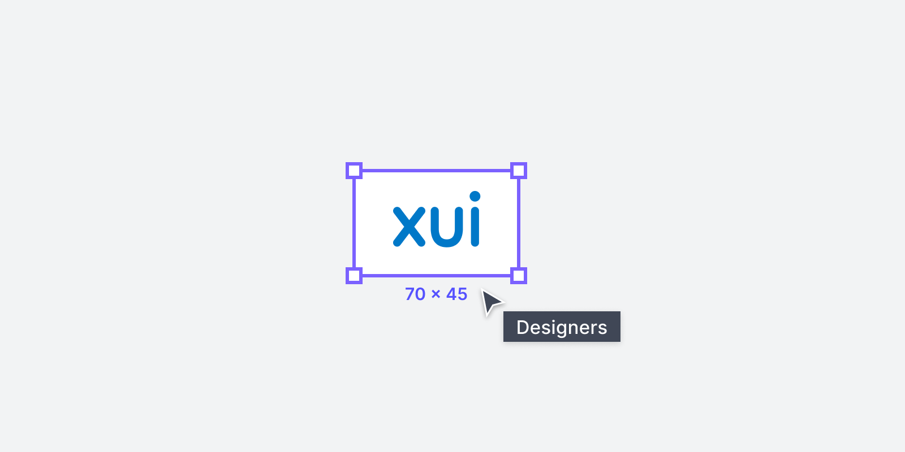
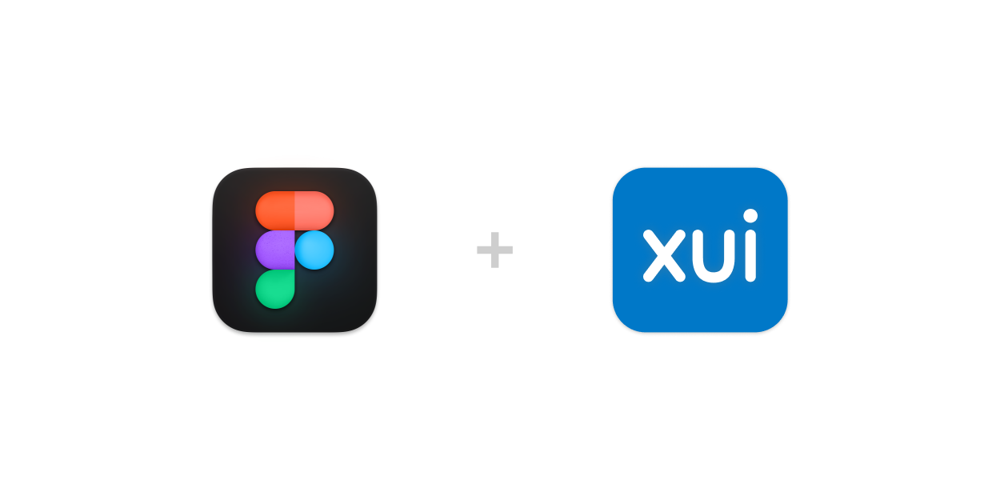

When it comes to translating user journeys into higher fidelity designs and prototypes, designers spend a lot of their time in Figma. We wanted to make it easier for designers to access the information they need, when and where they need it, so we built a Figma plugin that allows them to search and access Xero’s documentation directly from Figma. This reduces friction and saves time, allowing designers to focus on what they do best.

## XUI Figma Plugin

## Documentation

Onboarding to a new design system can be a daunting task, unfamiliar names and different component patterns can be difficult to pick up. We wanted the experience to be as seamless as possible, promoting discovery of components and best practices.
We integrated XUI's Figma library directly into the plugin so that when someone selects a XUI component, they can see the documentation for that component without searching.

