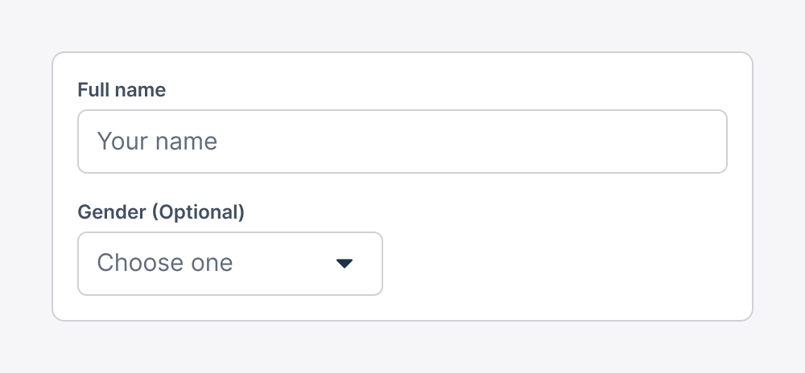

As a design system, both the guidance we provide, and the tools we build can greatly influence the experiences that teams craft for our customers. We have an opportunity to shape the way teams think about design, and the decisions they make. Because we're designing at scale, it's important for us to apply an ethical lens to our design decisions. We believe this also translates into an arguably better user experience.

When designing forms, we have a responsibility to consider the impact of the data we're asking for. We should consider the privacy implications of collecting data, and whether we really need it. We should also consider the cognitive load of asking for too much information, and whether we're creating unnecessary friction for our users.

Asking for only the information necessary to complete a task means we consider carefully what we're asking, it decreases the friction our users have with completing the task, and it means we limit the exposure of data we don't necessarily want to be responsible for.

At Xero, we suggest that you should identify any optional fields, and mark them as such.



These guidelines can apply pretty easily to a lot of traditional B2C experiences. Consider signing up, purchasing something.

Sometimes we need to ask for a lot of information in order to help the user, or ensure accuracy within the system.

But! Xero is complex, and many forms contain a large amount of optional fields (e.g. Contacts where only the name is required). In these circumstances we recommend identifying the required fields, in order to reduce the amount of information and density shown on the page.

If we were to expose this setting on each individual form element, the API becomes quite complex when we consider localisation. Does the implementer have to provide localised labels for both optional and required, is the input required, and how do we know which one to display?

```tsx showLineNumbers
export const FormExampleIdentifyOptional: FC = () => {
  return (
    <XUIForm identifyFieldsWith="optional" optionalLabel="(Optional)">
    // [!code highlight:1]
      <XUITextInput label="Name" isRequired />
      <XUITextInput label="Gender" />
    </XUIForm>
  )
}
```
XUI has started to focus on making components easier to use, and reducing the amount of props that need to be passed. This is especially important for a design system, where we want to reduce the cognitive load of using our components, and make it as easy as possible for teams to implement them correctly.

Leveraging React context locally in components helps provide a more simple API. The consumer can compose their forms without having to pass down props through every level of the component tree.


