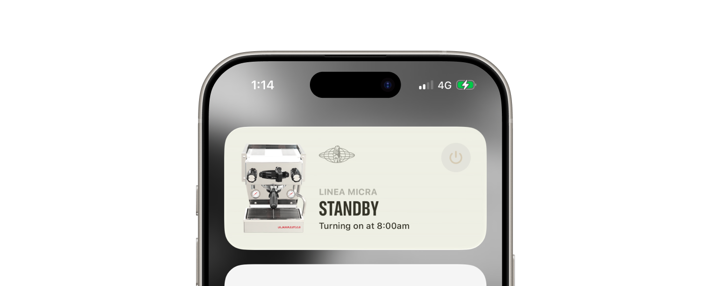

I bought a La Marzocco Linea Micra espresso machine a few years ago and have been enjoying making coffee at home. It has a simple app that connects to the machine over Wi-Fi, allowing me to start brewing remotely and monitor its status.
One of the best features of the Mini is it's quick heat up time, it can be ready to brew in under 4 minutes. This means you can leave the machine off, rather than keeping it on all day, and turn it on when you're ready to make coffee.
However, I often find myself wanting to quickly check if it's ready without having to open the app.

La Marzocco's Home app user experience has a few rough edges, and there's a lot of friction for the simple task of turning the machine on.

This is the perfect opportunity for an iOS widget.

> A widget elevates and displays a small amount of timely, relevant information from your app so people can see it at a glance in additional contexts.

Thankfully a bunch of people have reverse engineered the API for the machine, so I can access data like the boiler temperature and water level.

