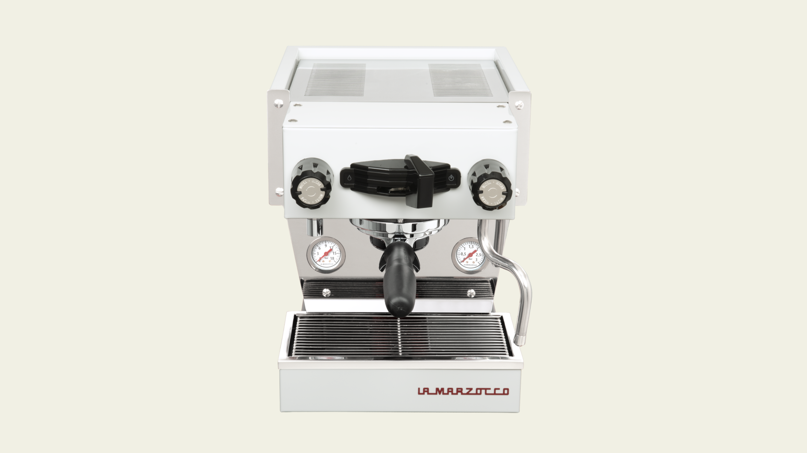

I bought a La Marzocco Linea Micra espresso machine a few years ago and have been enjoying making coffee at home. It has a simple app that connects to the machine over Wi-Fi, allowing me to start brewing remotely and monitor its status.

One of the best features of the Mini is it's quick heat up time, it can be ready to brew in under 4 minutes. This means you can leave the machine off, rather than keeping it on all day, and turn it on when you're ready to make coffee.
However, I often find myself wanting to quickly check if it's ready without having to open the app.

La Marzocco's Home app user experience has a few rough edges, and there's a lot of friction for the simple task of turning the machine on.

This is the perfect opportunity for an iOS widget.

> A widget elevates and displays a small amount of timely, relevant information from your app so people can see it at a glance in additional contexts.

Thankfully there's a community of people who have reverse engineered the API for the machine, so I can access data like the boiler temperature and water level.

## Building the widget

I built the widget using SwiftUI and WidgetKit, Apple's framework for creating home screen widgets. The widget displays real-time information from the espresso machine:

- **Machine status** – whether it's on, off, or heating up
- **Boiler temperature** – current temperature and target temperature
- **Water level** – so you know when to refill

The API uses WebSockets to push updates from the machine in real-time, which means the widget can show the current state immediately without the need for polling. I added support for multiple widget sizes so you can choose how much information you want to see at a glance.

## Design considerations

For the visual design, I wanted something that felt at home on iOS while also reflecting the premium, minimalist aesthetic of the La Marzocco hardware. I used SF Symbols for consistency with the system, and chose a simple color palette that adapts to light and dark mode.

<LaMarzoccoWidget />

Now I can check the machine status directly from my home screen or lock screen, making the morning coffee routine much more seamless. No more opening the app just to see if it's warmed up, or guessing when it'll be ready.

This project was a great opportunity to learn SwiftUI and explore iOS widget development, while solving a real pain point in my daily routine. It's amazing how a small amount of timely information, displayed in the right context, can significantly improve an experience.

