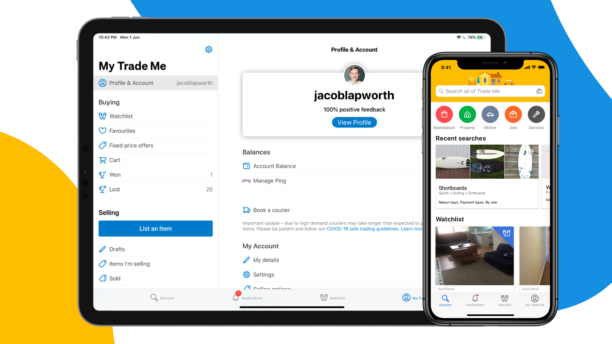
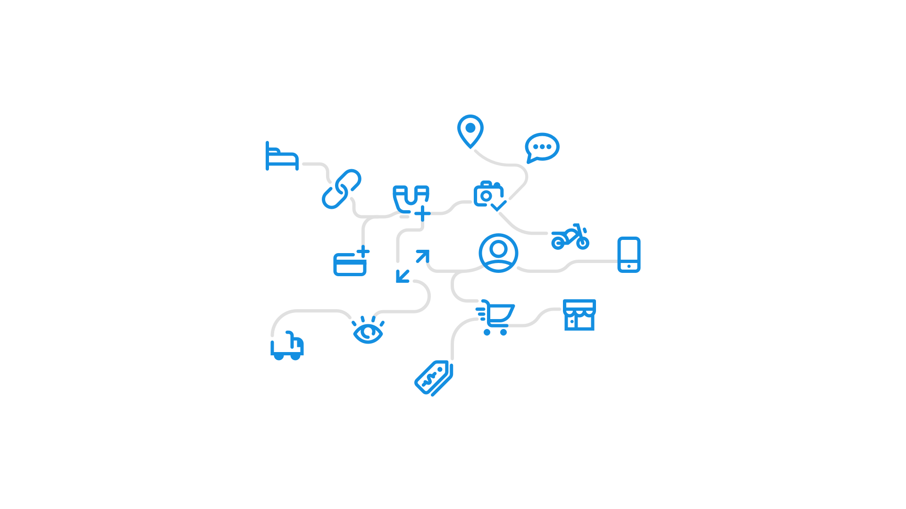
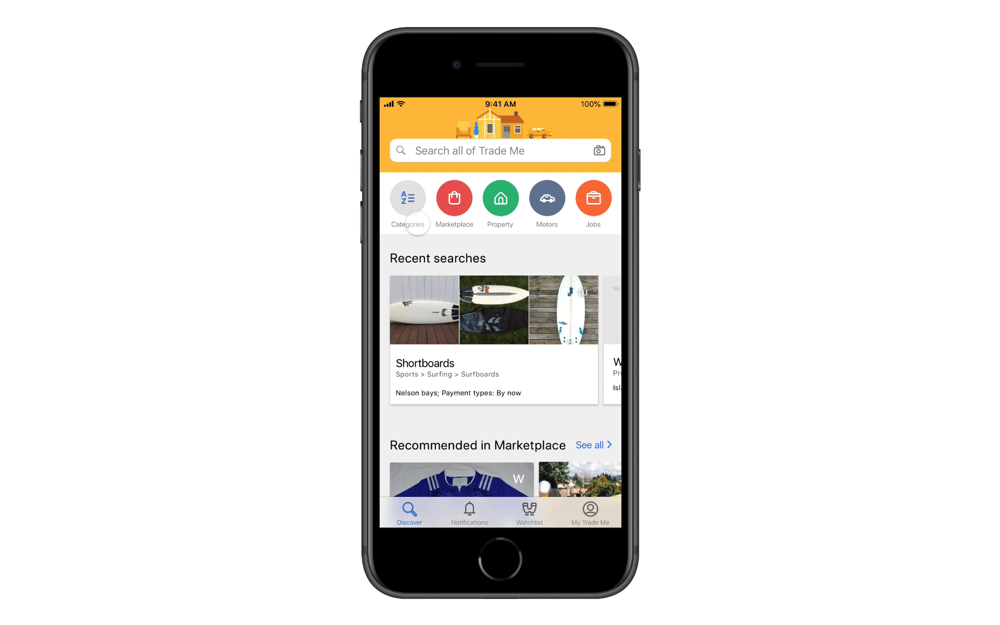

Trade Me is Aotearoa New Zealand's largest and most popular community for buying and selling used and new goods. It's origins started in selling second-hand goods but has expanded into other verticals, with Jobs, Property, Motors and Services. Sell your house, buy a vintage car, find a new job, do it all on Trade Me.

As these verticals have expanded, Trade Me has struggled to maintain a cohesive user experience across its platform. This legacy of piecemeal development has led to a fractured experience, with different parts of the app feeling disconnected from each other. My role was to help reimagine the user experience across the platform, focusing on creating a more cohesive experience that helped customers discover and engage with the different parts of Trade Me.

