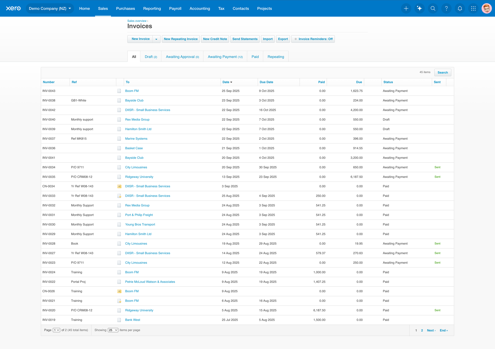
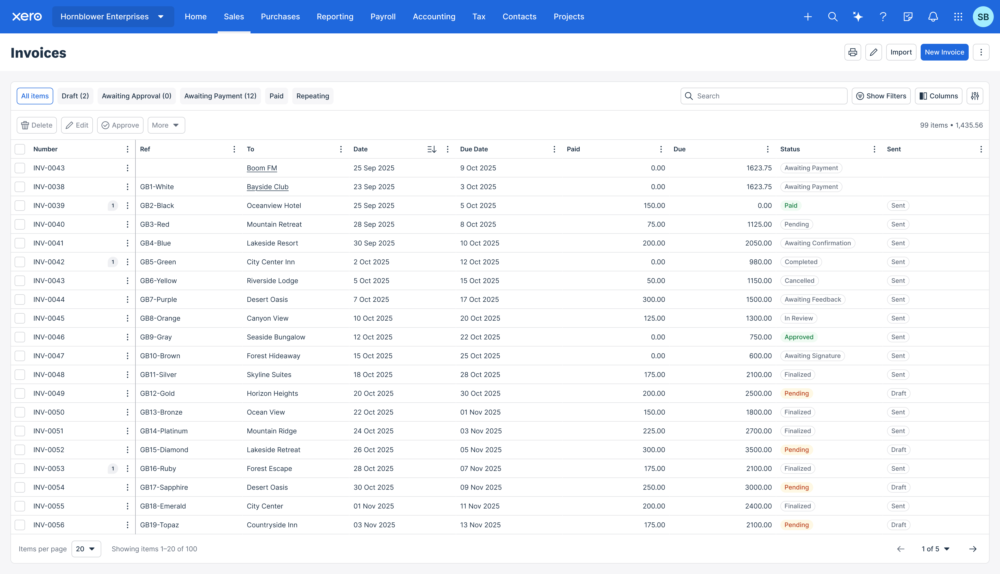
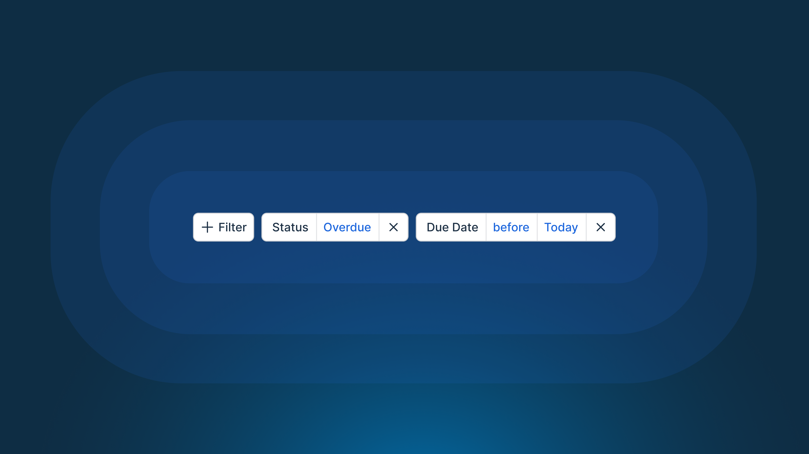
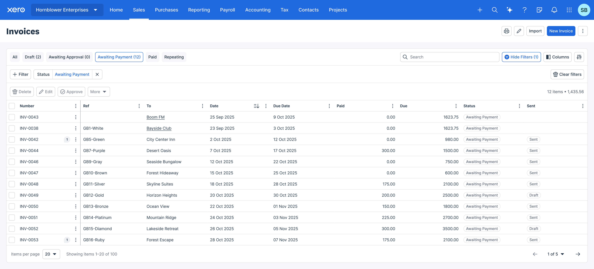
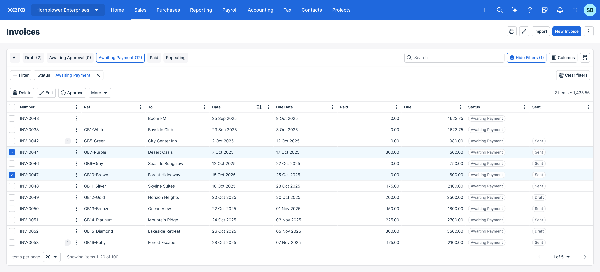
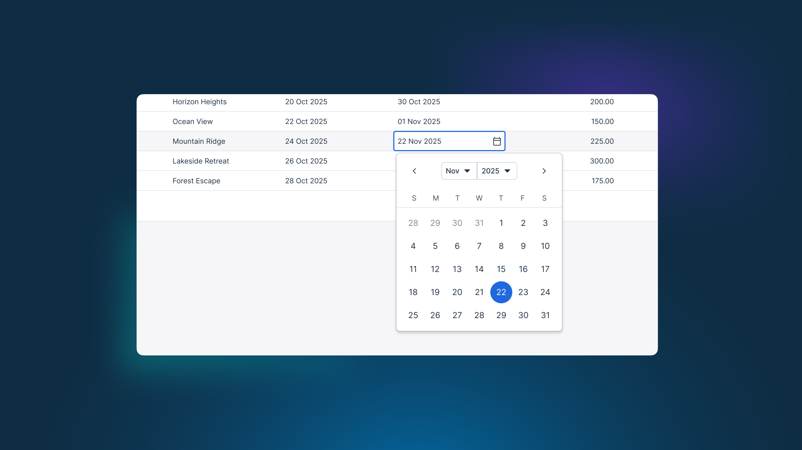

Tables are a fundamental component in many software applications, especially in data-intensive platforms like Xero. They provide a structured way to present large amounts of information, allowing users to easily scan, compare, and
interact with datasets within Xero.

## Legacy

## Principles

- Empower users to manage their own data
- Provide clear and concise information at a glance
- Ensure a consistent and intuitive user experience

## Redesign

The redesigned tables focus on improving usability, accessibility, and visual clarity. Key features include:
- Enhanced readability with improved typography and spacing
- Advanced filtering and sorting options
- Bulk actions for efficient data management
- Inline editing capabilities for quick updates
- Maintaining the same density to display more data on screen

### Filtering and sorting

A large focus of the redesign was to empower customers to quickly find and act on the data they need. 

This required us to completely re-evaluate how we present tabular data. We introduced a core principle of singular data types per column, allowing us to provide more relevant filtering and sorting options.

### Bulk actions

### Editing

