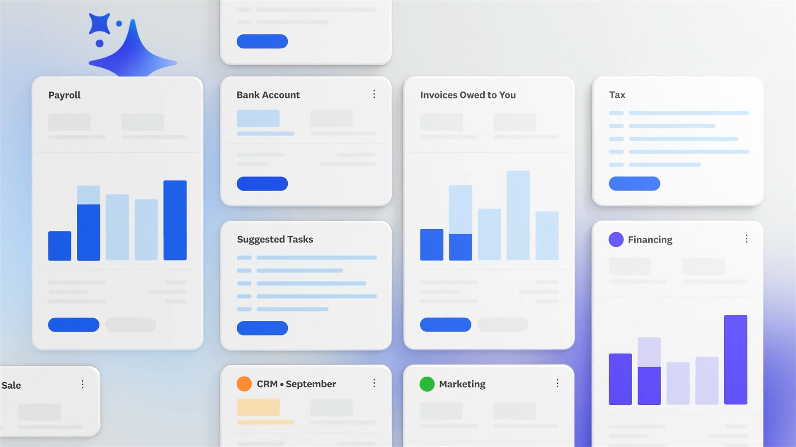

> Get a clearer view of business performance quickly with new widgets that highlight what needs your attention. The tailored view helps you stay focused on what matters most and take common actions directly from the page. For example, the new task list helps you prioritise and take prompt action on outstanding invoices and bills, and the enhanced banking widget shows where you have a balance difference and should complete a bank reconciliation

<Video src="/videos/announcement.mp4" caption="Xero homepage walkthrough" poster="/work/xero/homepage/announcement.jpg" />
<Video src="/videos/comparison.mp4" caption="Xero homepage old and new comparison" />

[Prototype](https://www.xero-reimagined-nav-hp.com/)

I'm excited to share a first look at one of the biggest design upgrades to Xero in years..

We've completely redesigned the homepage (formerly known as the dashboard) and navigation from the ground up, now available in beta. It’s a more intuitive, actionable space, purpose-built to help you move faster and make smarter decisions with confidence.

- a dynamic, customisable homepage
- simpler, more streamlined navigation
- powerful insights surfaced through customisable widgets
- a right-hand panel with enhanced JAX integration

This isn't just a new look, it's a foundation for the future, thoughtfully designed to save you time and put what matters most front and centre.

This mammoth upgrade is the result of a truly immense cross functional effort from countless talented individuals across Xero. A huge thank you to everyone who poured their passion and expertise into making this vision a reality.

Want to dive deeper into the details? I’ve written a short blog post about what’s new and what’s coming next.
